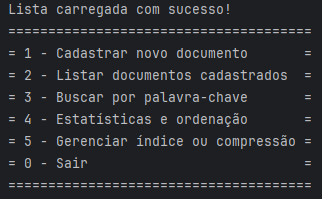

<h1 align="center">Sistema de Gestão e Busca de Documentos Compressos com Índice Dinâmico</h1>

Avaliação 03 da UC: <small>Estruturas de Dados e análise de algoritmos - UniRitter</small>

  <a href="#-objetivos">Objetivos</a>&nbsp;&nbsp;&nbsp;|&nbsp;&nbsp;&nbsp;
  <a href="#-implementacoes">Implementações</a>&nbsp;&nbsp;&nbsp;|&nbsp;&nbsp;&nbsp;
  <a href="#-tecnologias">Tecnologias</a>&nbsp;&nbsp;&nbsp;|&nbsp;&nbsp;&nbsp;
  <a href="#-testes">Rodando Testes</a>&nbsp;&nbsp;&nbsp;

 

  

 

## 🚩 Objetivos:

Desenvolva um sistema capaz de gerenciar, indexar, ordenar e buscar documentos de
texto armazenados em disco. O sistema deve suportar a inserção, remoção, ordenação
e compressão de documentos, além de oferecer buscas eficientes por palavras-chave.
Os documentos devem ser armazenados de forma persistente em arquivos e indexados
por múltiplas estruturas de dados, como árvores, tabelas hash e estruturas auxiliares
para compressão e ordenação.
 

## ✔ Implementações:
<ul style="list-style-type: circle">
  <li>Estruturas dinâmicas de dados para gerenciar os documentos e seus índices.</li>
  <li>Algoritmos de ordenação eficientes e análise de complexidade dos mesmos.</li>
  <li>Compressão de documentos usando codificação de Huffman.</li>
  <li>Índice reverso persistente com B+Tree ou Hashing para busca por palavras.</li>
  <li>Suffix Array e LCP Array para buscas por padrões de texto.</li>
</ul>
 

## 🚀 Tecnologias:

Esse projeto foi desenvolvido com as seguintes tecnologias:

- Java
- JUnit
- Huffman

## ▶ Rodando Testes:

### ⚠ Compilando TextStorageTest.java na raíz do projeto
javac -cp ".;lib\junit-platform-console-standalone-1.10.0.jar" TextStorage.java test\TextStorageTest.java

### ⚠ Rodando testes TextStorageTest.java JUnit
java -jar lib\junit-platform-console-standalone-1.10.0.jar -cp ".;test" --scan-classpath

### ⚠ Compilando ListaServiceTest.java na raíz do projeto
javac -d classes -cp "lib\junit-platform-console-standalone-1.10.0.jar" Lista\Node.java Lista\List.java Lista\ListService.java test\ListServiceTest.java

### ⚠ Rodando testes ListaServiceTest.java JUnit
java -jar lib\junit-platform-console-standalone-1.10.0.jar -cp "classes" --scan-classpath
